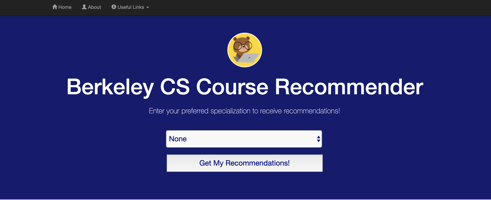

# Courserec

A recommendation engine for college courses.

### Current version: 1.0
Popularity-based recommender for UC Berkeley CS classes.

## How it works
1. Enter information about yourself (preferred specialization)
2. Get class recommendations.

## Stack
Django with Python 3.7

### Backend
By version
* Version 1.0: Popularity-based system (using course sizes)
* Version 2.0: *Coming Soon* Correlation-based system (learning from student preferences)

### Frontend
Frontend designed with HTML, CSS, Javascript.
